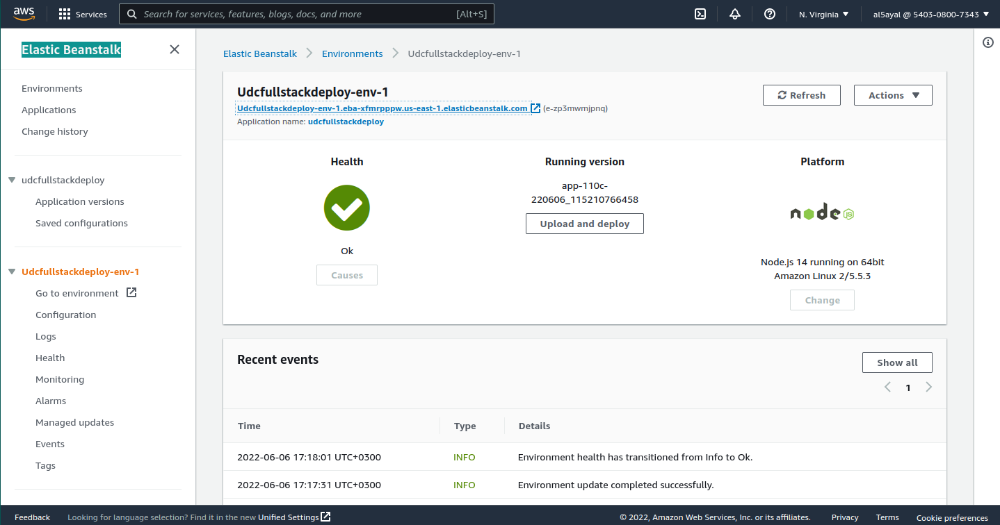
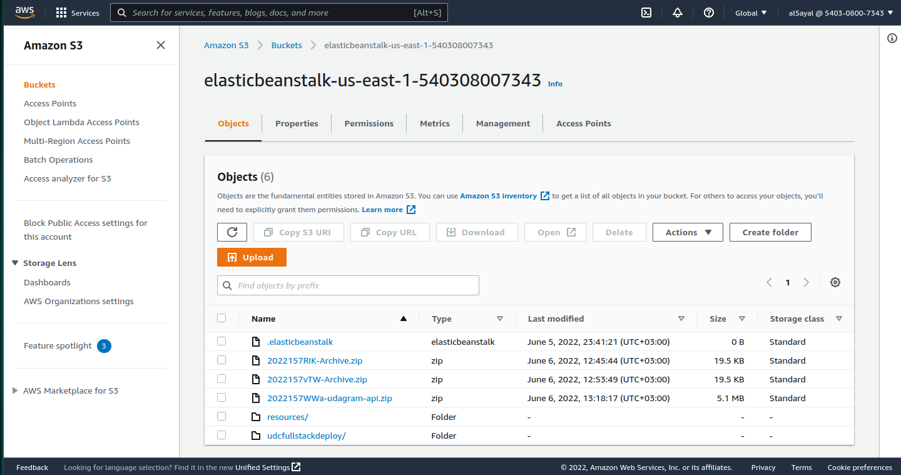
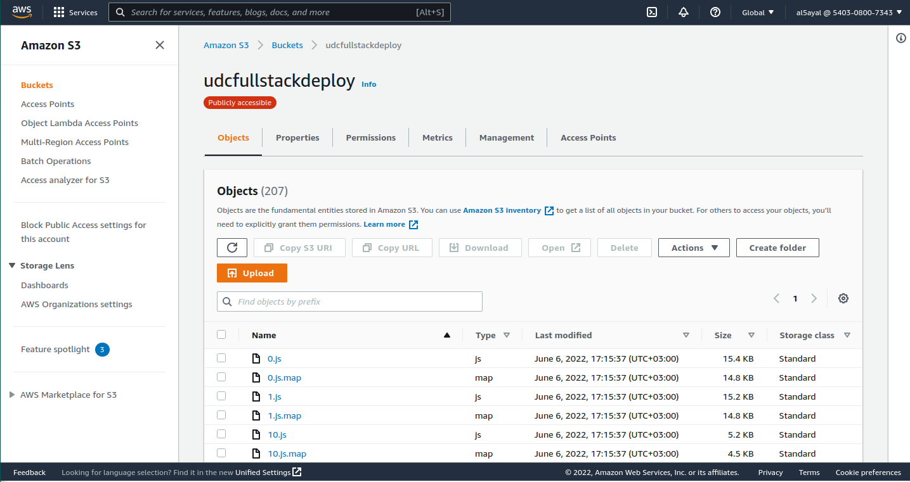
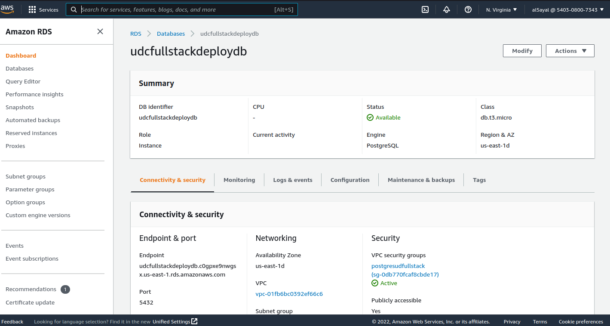
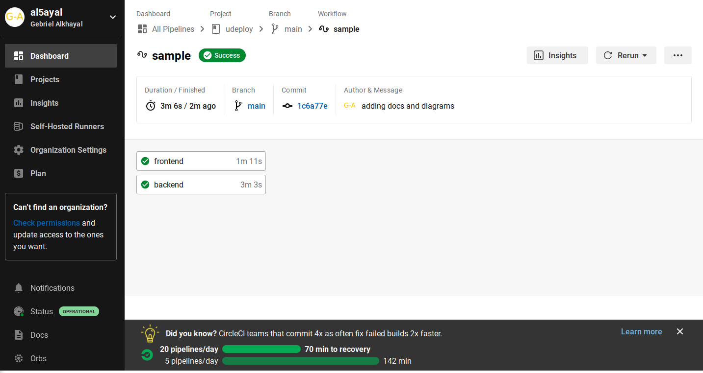
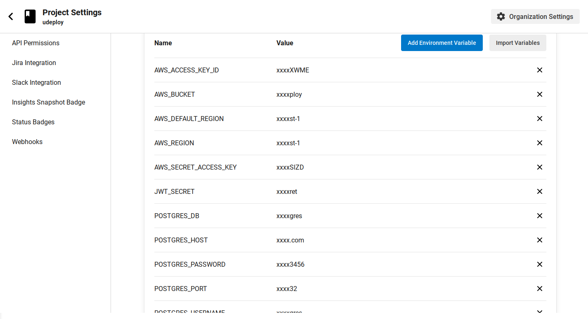

# Udagram

Deploying A fullstack application to aws services.

## Getting Started

The application is available at:
http://udcfullstackdeploy.s3-website-us-east-1.amazonaws.com

### Dependencies

check dependencies list from [here](docs/dependencies.md)

### App Infrastructure

check infrastructure explaination [here](docs/infrastructure.md)

### Pipeline details

check pipeline details [here](docs/pipeline.md)

## Configuration screenShots

### Elastic Beanstack

### Elastic Beanstack S3 Bucket

### Frontend S3 Bucket

### PostgreSQL RDS

### CircleCi PipeLine Results

### CircleCi environment variables

## Built With

- [Angular](https://angular.io/) - Single Page Application Framework
- [Node](https://nodejs.org) - Javascript Runtime
- [Express](https://expressjs.com/) - Javascript API Framework

## License

[License](LICENSE.txt)
