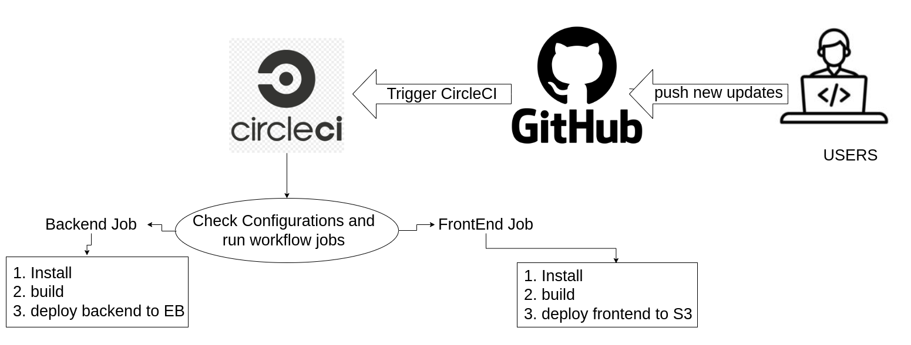

## Pipeline
### CI using Circleci
#### GitHub
The project repo is linked to the CircleCi service which Got triggered once any edits or updates get pushed to
the github repo by developers.

#### CircleCI
CircleCI is configured through `.circleci/config.yml` file which contains the pipeline Jobs and steps required to build and deploy the code to AWS Services.
Udagram `config.yml` file contains workflow settings and  2 jobs (frontend & backend) to be run by CircleCI.
- **Settings**: Required orbs such as node: circleci/node@4.1.0, aws-s3: circleci/aws-s3@2.0, eb: circleci/aws-elastic-beanstalk@2.0.1, aws-cli: circleci/aws-cli@2.0.2 AND it`s installation instructions.
- **Frontend**: Runs the `install` , `build` and `deploy` scripts from the `package.json` file. Then uploads assets to S3 using AWS CLI.
- **Backend**: Runs the `install` , `build` and `deploy` script which deploy zip archive compiled from typescript to elElastic Beanstalk, after setting up environmental variables to EB.

